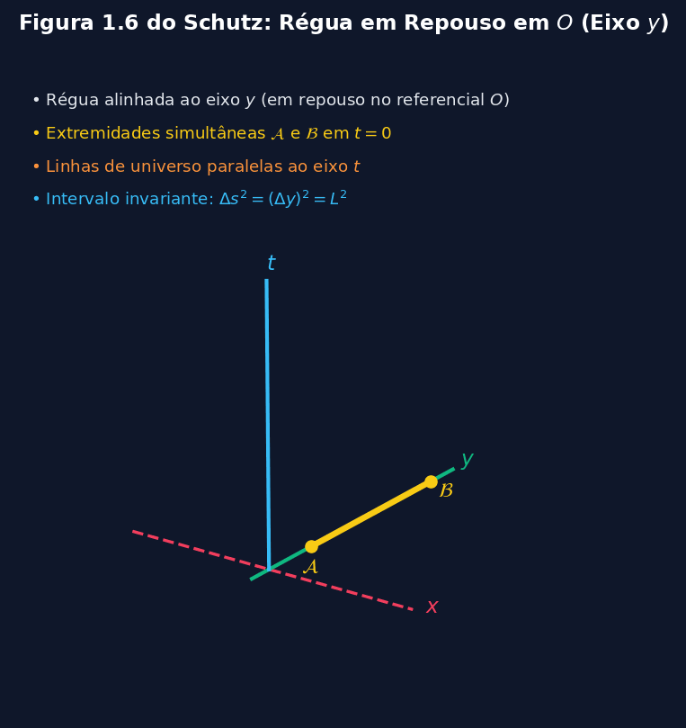
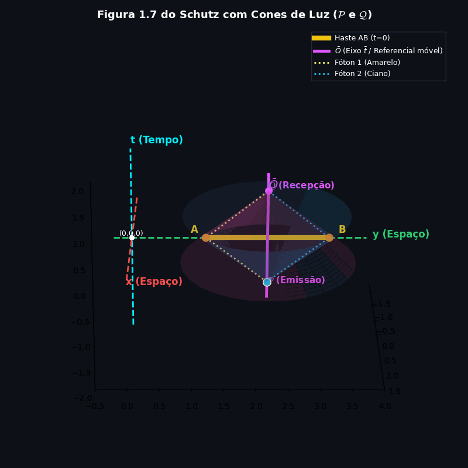
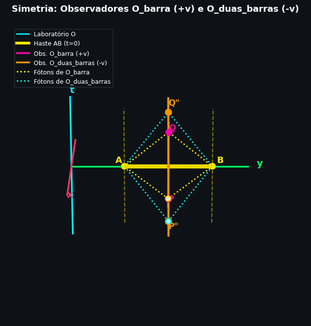
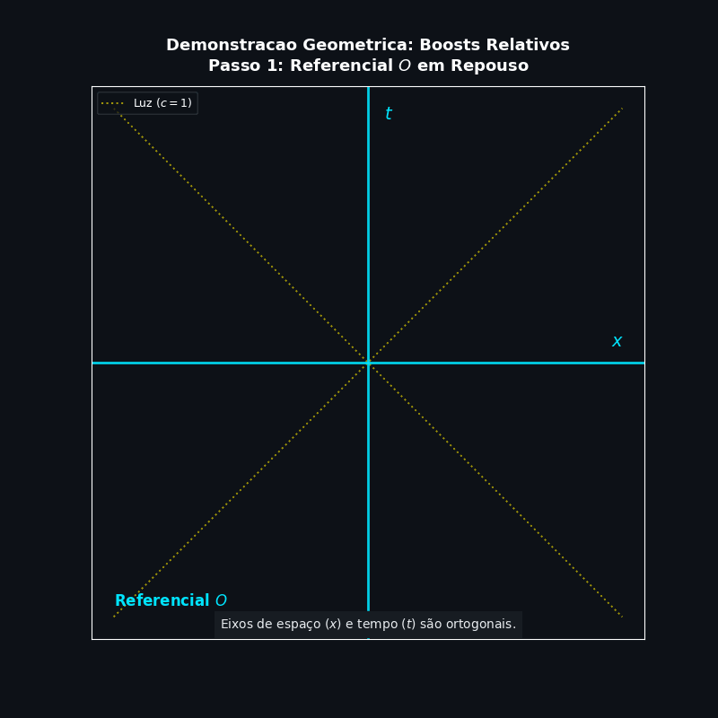
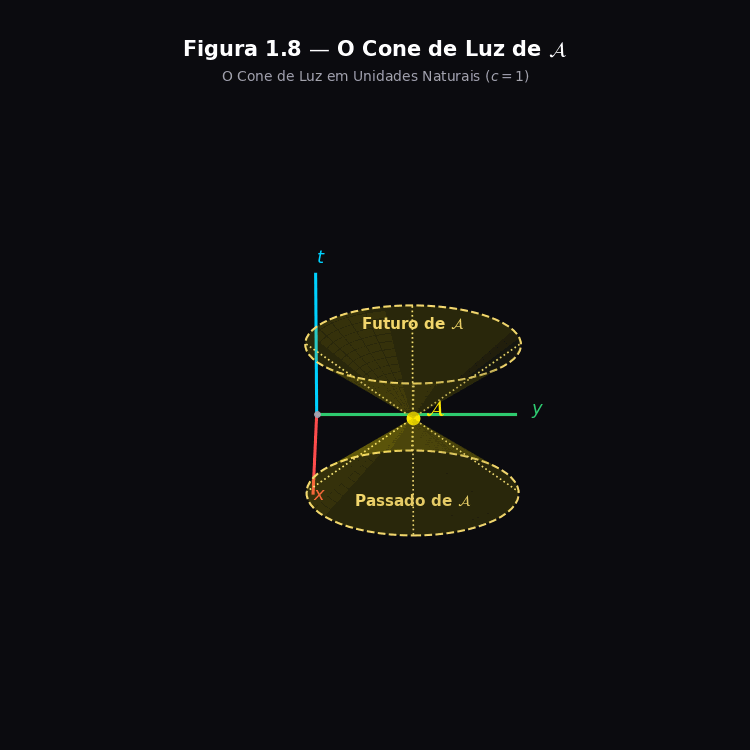

# Invariância do Intervalo: Por Que o Espaço-Tempo Tem uma Régua Própria?

Luana M. Souza

*Uma explicação passo a passo da Seção 1.6 de Bernard Schutz, o teorema mais importante da Relatividade Especial*

> **Antes de começar:** este post assume que você já leu [Geometria do Espaço-Tempo: O Experimento do Relógio de Luz](https://github.com/m0rang0azul/Relatividade-Geral---Diagrama-de-Minkowski), onde construímos os eixos $t,x$ e $\bar t, \bar x$ e vimos por que eles ficam inclinados um em relação ao outro. Aqui resolvemos o problema que ficou pendente: **sabemos a direção dos eixos, mas ainda não sabemos a escala**, ou seja, um "metro" no eixo $\bar t$ corresponde a quantos metros no eixo $t$?

---

## 1. O problema: faltava uma régua, $\Delta s^2$

Quando desenhamos os eixos $\bar t$ e $\bar x$ inclinados, resolvemos *onde* eles apontam. Mas um eixo inclinado, sozinho, não é o suficiente para fazer contas, falta saber a **escala**: se eu marco 1 metro no eixo $\bar t$, isso corresponde a quantos metros medidos no papel de $O$?

Para responder isso, o Schutz não mede réguas diretamente. Ele usa um truque muito mais elegante: define uma quantidade geométrica chamada **intervalo**, mostra que ela é a mesma para qualquer observador inercial, e usa essa invariância para calibrar os eixos. É a demonstração mais importante do capítulo, e talvez de toda a Relatividade Especial.

---

## 2. De onde vem a ideia: o raio de luz

Voltamos ao caso mais simples possível: dois eventos na linha de universo do **mesmo** raio de luz, por exemplo, o momento em que ele é emitido e o momento em que é refletido (eventos $\mathcal E$ e $\mathcal P$ das seções anteriores).

Como estamos usando $c=1$, a luz percorre 1 metro de espaço a cada 1 metro de tempo. Se o raio percorre uma distância espacial: 

$$
\Delta r = \sqrt{(\Delta x)^2 + (\Delta y)^2 + (\Delta z)^2}
$$ 

Imagine $\Delta r$ como sendo o comprimento do vetor que liga o ponto evento de emissão $E$ ao evento de reflexão $P$. Assim, num intervalo de tempo $\Delta t$, a velocidade da luz é:

$$
\frac{\Delta r}{\Delta t} = 1 \quad\Longrightarrow\quad \Delta r = \Delta t \quad\Longrightarrow\quad (\Delta x)^2 + (\Delta y)^2 + (\Delta z)^2 - (\Delta t)^2 = 0
$$

### A luz obedece à mesma regra em qualquer referencial

Pelo segundo postulado de Einstein, **qualquer observador inercial mede a velocidade da luz como sendo 1**, não importa quem emitiu o raio ou a que velocidade esse observador está se movendo. Isso significa que se o observador $\bar O$ medir as coordenadas dos mesmos dois eventos ($\mathcal E$ e $\mathcal P$), ele vai obter a *mesma* equação, só que com barras:

$$
(\Delta \bar x)^2 + (\Delta \bar y)^2 + (\Delta \bar z)^2 - (\Delta \bar t)^2 = 0
$$

Ou seja: **a mesma combinação de coordenadas dá zero nos dois referenciais**. 

---

## 3. Generalizando: o intervalo entre dois eventos quaisquer

Schutz então dá o passo de generalização: e se os dois eventos **não** estiverem na linha de universo de um raio de luz? A combinação de coordenadas acima não vai mais dar zero, mas ainda é uma quantidade que vale a pena estudar. Ele batiza essa quantidade de **intervalo**, e a define, para *quaisquer* dois eventos, como:

$$
\boxed{\Delta s^2 \equiv -(\Delta t)^2 + (\Delta x)^2 + (\Delta y)^2 + (\Delta z)^2} \quad \text{(1.1)}
$$

Pense nisso como uma versão do teorema de Pitágoras para o espaço-tempo, só que com um **sinal de menos** na parte do tempo. Esse sinal de menos será discutido mais à frente. Por enquanto, o que importa é: para dois eventos ligados por um raio de luz, $\Delta s^2 = 0$, e acabamos de mostrar que isso vale tanto para $O$ quanto para $\bar O$.

---

## 4. Por que a transformação entre referenciais tem que ser quadrática

**Hipótese de partida (linearidade):** como $O$ e $\bar O$ se movem um em relação ao outro com velocidade constante, sem aceleração, assumimos que a relação entre as coordenadas dos dois é **linear**, e que as origens coincidem (o evento $t=x=y=z=0$ é o mesmo que $\bar t = \bar x = \bar y = \bar z = 0$). Fisicamente, isso vem da ideia de que o espaço-tempo é homogêneo: as leis da física não têm um "lugar preferido", então a transformação entre coordenadas não pode ter termos que dependam da posição absoluta, só combinações lineares dos incrementos.

Isso significa que cada incremento com barra é uma combinação linear dos incrementos sem barra:

$$
\begin{aligned}
\Delta \bar t &= a_0\Delta t + a_1\Delta x + a_2\Delta y + a_3\Delta z \\
\Delta \bar x &= b_0\Delta t + b_1\Delta x + b_2\Delta y + b_3\Delta z \\
\Delta \bar y &= c_0\Delta t + c_1\Delta x + c_2\Delta y + c_3\Delta z \\
\Delta \bar z &= d_0\Delta t + d_1\Delta x + d_2\Delta y + d_3\Delta z
\end{aligned}
$$

onde os coeficientes $a_i, b_i, c_i, d_i$ podem depender da velocidade relativa $v$ entre os referenciais, mas **não** das próprias coordenadas.

**Agora vem o pulo do gato:** $\Delta \bar s^2$ é definido, pela Eq. 1.1, como

$$
\Delta \bar s^2 = -(\Delta \bar t)^2 + (\Delta \bar x)^2 + (\Delta \bar y)^2 + (\Delta \bar z)^2
$$

Cada um dos quatro termos do lado direito é o **quadrado** de uma combinação linear dos incrementos sem barra, com o termo $(\Delta \bar t)^2$ gerando 10 produtos (4 quadrados + 6 produtos cruzados, contando cada cruzado duas vezes). Fazendo isso para os quatro termos e somando tudo, o resultado, depois de agrupar os termos semelhantes, é necessariamente uma **forma quadrática geral** nos incrementos sem barra:

$$
\Delta \bar s^2 = \sum_{\alpha=0}^{3}\sum_{\beta=0}^{3} M_{\alpha\beta}(\Delta x^\alpha)(\Delta x^\beta) \quad \text{(1.2)}
$$

onde usamos a notação compacta $x^0 = t,\ x^1 = x,\ x^2 = y,\ x^3 = z$, e cada coeficiente $M_{\alpha\beta}$ é alguma combinação dos produtos $a_i a_j$, $b_i b_j$, etc. (por isso $M_{\alpha\beta}$ pode depender de $v$, mas não das coordenadas). Para entender de onde vem a Eq. 1.2, vamos expandir o termo temporal $(\Delta \bar{t})^2$. Substituindo as transformações lineares, obtemos uma soma de 16 termos. Agrupando-os na forma matricial, temos:

$$
A_{4 \times 4} =
\begin{pmatrix}
a_0 a_0 \Delta t^2 & a_0 a_1 \Delta t \Delta x & a_0 a_2 \Delta t \Delta y & a_0 a_3 \Delta t \Delta z \\
a_1 a_0 \Delta x \Delta t & a_1 a_1 \Delta x^2 & a_1 a_2 \Delta x \Delta y & a_1 a_3 \Delta x \Delta z \\
a_2 a_0 \Delta y \Delta t & a_2 a_1 \Delta y \Delta x & a_2 a_2 \Delta y^2 & a_2 a_3 \Delta y \Delta z \\
a_3 a_0 \Delta z \Delta t & a_3 a_1 \Delta z \Delta x & a_3 a_2 \Delta z \Delta y & a_3 a_3 \Delta z^2
\end{pmatrix}
$$

Essa mesma estrutura se repete para $(\Delta \bar{x})^2$, $(\Delta \bar{y})^2$ e $(\Delta \bar{z})^2$. Somando todas as contribuições e agrupando os termos semelhantes, chegamos à forma quadrática geral da Eq. 1.2, onde a matriz completa $M_{\alpha\beta}$ contém todos esses coeficientes combinados.

Um detalhe técnico que ajuda a simplificar: como só a **soma** $M_{\alpha\beta} + M_{\beta\alpha}$ aparece na Eq. 1.2 quando $\alpha \ne \beta$ (afinal, $M_{01}\Delta t \Delta x + M_{10}\Delta x \Delta t$ é a mesma coisa que $(M_{01}+M_{10})\Delta t \Delta x$), podemos, sem perda de generalidade, **redefinir** os coeficientes de forma que a matriz seja simétrica: $M_{\alpha\beta} = M_{\beta\alpha}$. Isso não muda a física, só deixa a contabilidade mais limpa, em vez de 16 coeficientes independentes, ficamos com 10 (4 na diagonal + 6 fora da diagonal, já que cada par simétrico conta uma vez).

---

## 5. Zerando os termos cruzados: de onde vêm as Eqs. 1.4a e 1.4b

Agora usamos a informação da Seção 2: sempre que $\Delta s^2 = 0$ (dois eventos ligados por luz), também $\Delta \bar s^2 = 0$. Ou seja, a Eq. 1.2 tem que dar zero **toda vez** que

$$
\Delta t = \Delta r = \left[(\Delta x)^2 + (\Delta y)^2 + (\Delta z)^2\right]^{1/2}
$$

para **qualquer** direção espacial do raio de luz (ele pode ir para qualquer lado, não só ao longo de um eixo). Substituindo $\Delta t = \Delta r$ na Eq. 1.2 e expandindo, obtemos (depois de reorganizar):

$$
\Delta \bar s^2 = M_{00}(\Delta r)^2 + 2\sum_{i=1}^{3} M_{0i}\Delta x^i\Delta r + \sum_{i=1}^{3}\sum_{j=1}^{3} M_{ij}\Delta x^i \Delta x^j = 0
$$

Essa expressão precisa ser **zero para qualquer direção** do vetor $(\Delta x, \Delta y, \Delta z)$, não só para uma direção específica. Pense bem no que isso exige: se o raio de luz for disparado na direção $+x$, temos $\Delta y = \Delta z = 0$ e a equação vira uma relação envolvendo só $M_{00}, M_{01}, M_{11}$. Se disparado na direção $-x$, o termo cruzado $M_{01}\Delta x\Delta r$ **troca de sinal** (porque $\Delta x$ trocou de sinal, mas $\Delta r$ continua positivo, é uma distância), enquanto os termos quadráticos ($M_{00}(\Delta r)^2$ e $M_{11}(\Delta x)^2$) não mudam.

Na direção $+x$

$$
\Delta \bar s^2 = M_{00}(\Delta r)^2 + 2\sum_{i=1}^{3} M_{0i}\Delta x^i\Delta r + \sum_{i=1}^{3}\sum_{j=1}^{3} M_{ij}\Delta x^i \Delta x^j = 0
$$

Na direção $-x$

$$
\Delta \bar s^2 = M_{00}(\Delta r)^2 - 2\sum_{i=1}^{3} M_{0i}\Delta x^i\Delta r + \sum_{i=1}^{3}\sum_{j=1}^{3} M_{ij}\Delta x^i \Delta x^j = 0
$$

Para a soma continuar dando zero nas duas direções opostas (iguale as equações), o termo que muda de sinal é **obrigado a ser zero por si só**. Repetindo esse raciocínio para as direções $y$ e $z$ (e depois para combinações de direções), a única saída é:

$$
M_{0i} = 0, \quad i = 1,2,3 \quad \text{(1.4a)}
$$

Com isso, os termos cruzados entre tempo e espaço desaparecem, e o que resta da expressão é:

$$
\Delta \bar s^2 = M_{00}(\Delta r)^2 + \sum_{i=1}^{3}\sum_{j=1}^{3} M_{ij}\Delta x^i \Delta x^j = 0
$$

Agora precisamos eliminar o $(\Delta r)^2$ em favor dos incrementos espaciais individuais. Para isso, lembramos da definição de distância espacial:

$$
(\Delta r)^2 = (\Delta x)^2 + (\Delta y)^2 + (\Delta z)^2
$$

que, em notação de índices, pode ser escrita como

$$
(\Delta r)^2 = \sum_{i=1}^{3}\sum_{j=1}^{3} \delta_{ij}\Delta x^i \Delta x^j
$$

onde $\delta_{ij}$ é o **delta de Kronecker** (vale 1 se $i=j$, e 0 caso contrário). Substituindo essa expressão de volta na equação anterior, obtemos:

$$
\Delta \bar s^2 = M_{00}\sum_{i=1}^{3}\sum_{j=1}^{3} \delta_{ij}\Delta x^i \Delta x^j + \sum_{i=1}^{3}\sum_{j=1}^{3} M_{ij}\Delta x^i \Delta x^j = 0
$$

Colocando os dois somatórios em evidência:

$$
\Delta \bar s^2 = \sum_{i=1}^{3}\sum_{j=1}^{3}\left(M_{00}\delta_{ij} + M_{ij}\right)\Delta x^i \Delta x^j = 0
$$

Como isso precisa valer para **qualquer** escolha de $(\Delta x, \Delta y, \Delta z)$ que satisfaça a condição de luz, cada coeficiente entre parênteses tem que se anular individualmente:

$$
M_{00}\delta_{ij} + M_{ij} = 0 \quad\Longrightarrow\quad M_{ij} = -M_{00}\delta_{ij}, \quad i,j = 1,2,3 \quad \text{(1.4b)}
$$

Ou seja: a matriz espacial precisa ser **diagonal**, e todas as entradas da diagonal têm que ser iguais a $-M_{00}$. Substituindo essa condição de volta na Eq. 1.2, a expressão gigante de 16 termos colapsa para algo muito mais simples:

$$
\Delta \bar s^2 = M_{00}\left[(\Delta t)^2 - (\Delta x)^2 - (\Delta y)^2 - (\Delta z)^2\right] = -M_{00}\Delta s^2
$$

---

## 6. Batizando a função $\phi(v)$

Definimos $\phi(v) \equiv -M_{00}$. Como esse coeficiente só pode depender da velocidade relativa $v$ entre os referenciais, nunca das coordenadas dos eventos (princípio da homogeneidade do espaço-tempo, não existem posições nem momentos especiais no espaço), chegamos ao resultado central desta parte da demonstração:

$$
\Delta \bar s^2 = \phi(v) \Delta s^2 \quad \text{(1.5)}
$$

Isso já é um resultado e tanto: descobrimos que o intervalo medido por $\bar O$ é sempre **proporcional** ao intervalo medido por $O$, e a constante de proporcionalidade só pode depender da velocidade relativa entre eles. Falta provar que essa constante é exatamente $1$, é isso que vem agora.

---

## 7. Primeira parte da prova: $\phi$ depende só do módulo de $v$

Para mostrar que $\phi(v) = 1$, Schutz usa um argumento geométrico em duas etapas. A primeira etapa mostra que $\phi$ não pode depender da *direção* de $v$, só do seu módulo $|v|$.

A ideia: imagine uma barra em repouso no referencial $\bar O$, orientada **perpendicularmente** à velocidade relativa entre $O$ e $\bar O$ (por exemplo, ao longo do eixo $y$, se o movimento relativo é na direção $x$). 

  

O comprimento dessa barra, medido por $\bar O$, é o intervalo entre dois eventos simultâneos nas duas pontas da barra (a reflexão dos fótons em $A$ e $B$ emitidos simultaneamente do ponto $P$), e, como vimos na Eq. 1.5, esse intervalo se relaciona com o intervalo medido por $O$ através de $\phi(v)$:

$$
(\text{comprimento da barra em } \bar O)^2 = \phi(v)(\text{comprimento da barra em } O)^2 \quad \text{(1.6)}
$$

  

Aqui entra o **princípio da relatividade**: o comprimento de uma barra perpendicular ao movimento não pode depender da *direção* em que o referencial se move, só da rapidez relativa. Não existe uma direção "especial" no espaço; se o movimento fosse, digamos, para a direita em vez de para a esquerda, a física tem que ser a mesma. Isso força:

$$
\phi(v) = \phi(|v|)
$$

ou seja, $\phi$ só pode ser função da velocidade relativa, nunca de "para que lado" o referencial está se movendo.

---

## 8. Segunda parte da prova: $\phi(v) = 1$

A segunda etapa usa o mesmo princípio da relatividade, mas de um jeito mais sutil, comparando três referenciais em vez de dois. Imagine três observadores: $O$, $\bar O$, e um terceiro, $O'' \equiv \bar{\bar O}$. O referencial $\bar O$ se move com velocidade $v$ na direção $x$ em relação a $O$. O referencial $O''$ se move com velocidade $v$ na direção **negativa** de $x$ em relação a $\bar O$. Ou seja: $\bar O$ se afasta de $O$ para a direita, e $O''$ se afasta de $\bar O$ para a esquerda, com a **mesma rapidez** $v$.

1. O GIF abaixo representa o diagrama de Minkowisk para um terceiro observador $O''$, viajando em relação à $O$ com uma velocidade $v$ na direção negatitiva de $x$. Agora, o que aconteceria se esse mesmo observador $O''$, viaja-se a uma velocidade $v$ na direção negativa $x$ em relação $\bar O$?

  

2. O truque geométrico é notar que, com essa configuração, $O''$ acaba sendo **idêntico** a $O$, ele volta a ficar em repouso relativo a $O$ (a velocidade "ida" e "volta" se cancelam).

  

Usando a Eq. 1.5 duas vezes em sequência (de $O$ para $\bar O$, e depois de $\bar O$ para $O''$):

$$
\Delta \bar s^2 = \phi(v)\Delta s^2 \qquad \text{e} \qquad \Delta s''^2 = \phi(v)\Delta \bar s^2
$$

Substituindo a primeira na segunda:

$$
\Delta s''^2 = \phi(v)\phi(v)\Delta s^2 = [\phi(v)]^2\Delta s^2
$$

Mas como $O''$ e $O$ são o mesmo referencial, $\Delta s''^2$ e $\Delta s^2$ têm que ser **iguais**. Logo:

$$
[\phi(v)]^2 = 1 \quad\Longrightarrow\quad \phi(v) = \pm 1
$$

Sobra escolher o sinal. Lembre da Eq. 1.6: $\phi(v)$ multiplica o quadrado do comprimento de uma barra física, e comprimento ao quadrado tem que ser **positivo**. Isso descarta o $-1$, e sobra:

$$
\phi(v) = 1
$$

---

## 9. O teorema: o intervalo é invariante

Juntando tudo, chegamos ao resultado que o capítulo inteiro estava construindo:

$$
\boxed{\Delta s^2 = \Delta \bar s^2}
$$

**O intervalo entre dois eventos é o mesmo, não importa qual observador inercial o calcule.** É por isso que ele se chama *intervalo invariante*, e é essa invariância que nos dá, finalmente, a régua que faltava para calibrar os eixos inclinados $\bar t, \bar x$: sabemos agora que um "metro" de intervalo medido ao longo do eixo $\bar t$ corresponde exatamente a um metro de intervalo medido ao longo do eixo $t$, mesmo que a *aparência* das distâncias no papel seja diferente por causa da inclinação.

Como bônus, a primeira parte da prova (Seção 7) também nos deu de graça outro resultado útil: **o comprimento de uma barra perpendicular ao movimento relativo é o mesmo em qualquer referencial**, só as barras *paralelas* ao movimento sofrem contração (é a famosa contração de Lorentz, que fica para um próximo post).

---

## 10. Classificando pares de eventos

Como $\Delta s^2$ é uma propriedade **apenas dos dois eventos**, o mesmo valor não importa quem mede, ele nos dá um jeito universal de classificar a relação causal entre eles:

| Sinal de $\Delta s^2$ | Nome | Significado físico |
|---|---|---|
| $\Delta s^2 > 0$ | Separação **tipo-espaço** | os termos espaciais dominam; $\Delta s^2$ é chamado de **distância própria** entre os eventos |
| $\Delta s^2 < 0$ | Separação **tipo-tempo** | o termo temporal domina; $-\Delta s^2$ é chamado de **tempo próprio** entre os eventos |
| $\Delta s^2 = 0$ | Separação **tipo-luz** (ou nula) | os eventos estão na linha de universo do mesmo raio de luz |

Essa classificação não é só um rótulo, ela é a base geométrica de toda a estrutura causal da relatividade (o "cone de luz" que separa passado, futuro e o que nunca poderá influenciar um evento). Vale a pena explorar isso com calma num próximo post.

  

---

## Referências

- SCHUTZ, Bernard. *A First Course in General Relativity*. 3ª ed. Cambridge: Cambridge University Press, 2022. Capítulo 1, Seção 1.6.

---

*Post baseado no experimento mental do relógio de luz e nos diagramas de Minkowski, seguindo a abordagem do livro de Bernard Schutz, "A First Course in General Relativity".*
